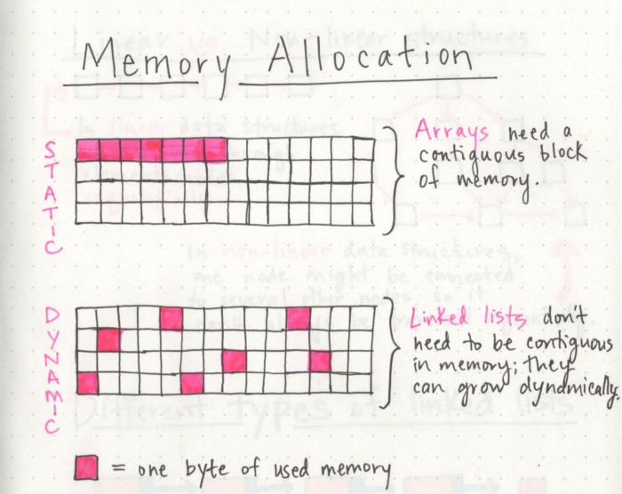

# Linked Lists

Linked lists is a Data Structure. it is similar to arrays but a little different!

it is a sequence of Nodes that are connected/linked to each other. The most defining feature of a Linked List is that each Node references the next Node in the link.

One of the main differences (and coolest one) is how the memory usage of linked lists. 

Let's start speaking about arrays data usages so we can appreciate the linked lists more. 

arrays take memory as a whole block, meaning that each chunk taken by a part of the array should be next to it's neighbors in the memory hardware device. 
as for linked lists, nodes can be seperated from each other, so technically they take the same "amount" of memory, but the arrangment is different, and more practical. this also allows for the linked list to change in size which gives more space than having to find a certain block for the array. 

check the illustration below!

